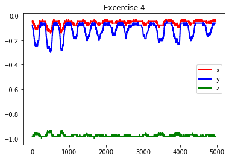

# Physiotherapy-Exercise-Recognition
Musculoskeletal Disorder physiotherapy exercise recognition & quality assessment using sensor data from accelerometers.

## Problem Context & Importance

### What are Musculoskeletal Disorders 
Musculoskeletal Disorders or MSDs are injuries and disorders that affect the human body’s movement or musculoskeletal system (i.e. muscles, tendons, ligaments, nerves, discs, blood vessels, etc.). When a worker is exposed to MSD risk factors, they begin to fatigue and when fatigue outruns their body’s recovery system, they develop a musculoskeletal imbalance. Over time, as fatigue continues to outrun recovery and the musculoskeletal imbalance persists, a musculoskeletal disorder develops.

### Impact of MSDs

Following are several statistics which indicate the impact of MSDs  
•	MSDs are the single largest category of workplace injuries and are responsible for almost 30% of all worker’s compensation costs  
•	U.S. companies spent 50 billion dollars on direct costs of MSDs  
•	Indirect costs can be up to five times the direct costs of MSDs  
•	The average MSD comes with a direct cost of almost $15,000  

### How does physiotherapy helps with MSDs
Physiotherapy exercises can help reduce the symptoms of musculoskeletal conditions. It contributes to improved physical function, allowing individuals to return to healthy living, including return to work and recreational activities. It also promotes recovery from injury, reduces the risk of re-injury and enables early detection of acute events.

## Problem Statement

The problem statement for defining the scope of this project is as follows,  

•	Develop models for physiotherapy exercise recognition to aid in prevention or self-management of Musculoskeletal Disorders  
•	Create a scoring mechanism for assessing the quality of exercises to enable self-monitoring without expert supervision 

## Why this problem was selected

Finding technological solutions for prevention or self-management of MSD is an important problem to solve. This problem was selected because of the reason below,  
•	The proposed model has important applications in real-time digital feedback systems  
•	The market presently has a few physiotherapy exercise recognition apps but not specifically for MSDs  
•	The solution and learnings gathered here can be applied to different kinds of Human Activity Recognition problems  
•	From a Machine Learning problem perspective, this is an interesting problem to solve as exercise recognition involves predictive modelling using spatial data with a temporal aspect attached to it  

## Input Data
Exercises dataset contains multi-sensor data corresponding to 7 exercises performed by 30 subjects.

### Data Collection Method
Each subject was given a sheet of 7 exercises with instructions to perform the exercise at the beginning of the session. At the beginning of each exercise the researcher demonstrated the exercise to the subject, then the subject performed the exercise for maximum 60 seconds while being recorded with four sensors. During the recording, the researcher did not give any advice or kept count or time to enforce a rhythm.

### Data Recording Device
The data collection device was an Axivity AX3 3-Axis Logging Accelerometer.  

### Sensor Placement
All the exercises were performed lying down on the mat while the subject was wearing two accelerometers on the wrist and the thigh.

### Data Folder Structure
The data folder has four folders, one each for four different sensors. Inside each sensor folder, 30 folders can be found, one for each subject. In each subject folder, 8 files can be found for each exercise with 2 files for exercise 4 as it is performed on two sides. 
Note: For this project we are considering the data only from the accelerators, that is, ‘act’ & ‘acw’ folders. And considering just one file for exercise 4 to have a consistent data format across exercises. 

### Data Attributes Information
The 4 columns in the act and acw files is organized as follows:  
1. timestamp: Time at which each row was recorded by the accelerator  
2. x value: Acceleration (in m/s2) in x direction  
3. y value: Acceleration (in m/s2) in y direction  
4. z value: Acceleration (in m/s2) in z direction  

### Data Sample
Below is a small sample of the actual data to get a better sense of what it looks like.  

## Exercises

Following are the seven exercises being considered. These exercises are the ones regularly recommended for MSD patients by physiotherapists.

**1. Knee-rolling**
 
Starting position: Lying on back, knees together & bent, feet flat on floor
Action: Slowly roll knees to the right, back to the center, then to the left, keeping upper trunk still

**2. Bridging**
 
Starting position: Lying on back with knees bent and slightly apart, feet flat on floor & arms by side
Action: Squeeze buttock muscles and lift hips off floor. Hold approximately 5-seconds & lower slowly

**3. Pelvic tilt**
 
Starting position: Lying on back with knees bent and slightly apart, feet flat on floor & arms by side
Action: Tighten stomach muscles and press small of back against the floor letting your bottom rise. Hold approximately 5 seconds then relax

**4. Clam**
 
Starting position: Lying on right side with hips & shoulders in straight line. Bend knees so thighs are at 90° angle. Rest head on top arm (stretched overhead or bent depending on comfort). Bend top arm & place hand on floor for stability. Stack hips directly on top of each other (same for shoulders)
Action: Keep big toes together & slowly rotate leg in hip socket so the top knee opens. Open knee as far as you can without disturbing alignment of hips. Slowly return to starting position

**5. Repeated Extension in Lying**
 

Starting position: Lying face down, place palms on floor & elbows under shoulders (press-up position)
Action: Straighten elbows as far as you can & push top half of body up as far as you can. Pelvis, hips & legs must stay relaxed

**6. Prone punches**
 
Starting position: On all 4’s with hands directly beneath shoulders, knees slightly apart and straight back
Action: Punch right arm in front of you & lower to floor. Repeat with left arm. Keep trunk as still as possible

**7. Superman**
 
Starting position: On all 4’s with hands directly beneath shoulders, knees slightly apart and straight back
Action: Extend right arm straight in front of you & left leg straight behind you, keeping trunk as still as possible. Hold approximately 5-seconds then lower & repeat with other arm & leg

## Data Exploration

Raw Data - Thigh Accelerometer

Following are the plots from the data collected through the thigh accelerometer for one subject.
The x axis denotes the observation number and the y axis denotes the acceleration (in m/s2). The red, green and blue lines indicate the acceleration values in the x, y and z direction.  

Outlier Analysis

The plots below show boxplots for each of the 7 exercises (labelled 1 to 7 on the x axis) and for each of the axes – x, y and z (blue, orange and green). The y-axis is the acceleration value (in m/s2).  

  

## Feature Engineering

### Feature Engineering – Windowing with overlap
 
Each observation in the dataset contains acceleration values corresponding to 1/100th second of exercise because the sampling frequency of the accelerometer is 100 Hz. This timeframe is too small to capture any significant movement (during exercise). We would thus like to aggregate multiple observations in a single window to be able to capture some movement in each window/observation. 
Overlapping becomes important if the signals in each interval are not independent from the other intervals. If the windows are not overlapping, we will be missing any information at the boundary of the windows.

#### Windowing Process Steps
Here we are using a window length of 4 seconds and an overlap of 1 second  
•	Take all rows from t = 0 to t = 4. Since the sampling frequency is 100 Hz, 100 rows have data for 1 second and thus 400 hundred rows will have data for 4 seconds  
•	Thus, we now have 400 rows for each of the three features - acceleration in x, y and z direction in a single window  
•	To convert this window into a single row, we will append the 400 rows of data from each of the x, y and z columns into one single row 
•	So, the three features (acceleration in x, y and z direction) and 400 rows each are now converted to 400 * 3 = 1200 features in just 1 row  

#### Overlap Process Steps
•	Overlap just ensures that two consecutive windows have a 1 second data overlap  
•	For example, after implementing windowing with overlap, the first window will have data from t = 0 to t = 4, and the second window will have data from t = 4 to t = 7 and so on  

Process for determining the Window Length and Overlap Length  
•	The optimal combination of window length and overlap length was obtained by trying out multiple different combinations using LOOCV on SVM model with AUC metric  
•	The different combinations to be tried out were determined by looking at benchmarked numbers from other Human Activity and Exercise Recognition problems  
•	The combination that gave the highest SVM model AUC was selected  
•	SVM was selected here over other models because of its high execution speed  
•	The optimal window and overlap length was found to be 4 seconds and 1 second respectively  

## Feature Transformation and Selection

Now that we have 1200 features to work with, we will look at how we take transform them and then select the most important features.  

**Feature Transformation – Discrete Cosine Transform**  
The idea behind DCT is to convert the data in the spatial domain into a frequency domain for better feature representation. DCT expresses a finite sequence of data points in terms of a sum of cosine functions oscillating at different frequencies.  

How was DCT applied  
•	DCT does not change the dimensions of the data by itself, it just transforms all values to frequency domain and returns output data which has the same dimensions as the input data  
•	DCT was applied during the windowing process, and not after windowing. This is because DCT is to be applied to each of x, y and z columns separately  

### Why DCT and how is it similar to PCA
An important property of DCT is that the DCT coefficients are ordered based on frequencies where initial frequencies encode more information. PCA also has a similar property where it returns principal components which are ordered based on the amount of variance they capture where the initial principal components encode more information or variance.
We can thus use DCT for feature selection, that is, retain only those features that encode significant amount of information.

### Feature Importance – Selecting the optimal number of DCT Coefficients 
The optimal number of DCT features was obtained by plotting the DCT coefficients for each of the axes. We know that DCT orders the features based on frequencies such that the lower frequencies encode more information. Thus, the idea here is to find out the threshold where the frequency starts to increase and discard the high frequency features. We plotted DCT coefficients multiple times with different maximum number of coefficients to get a sense of the optimum threshold.  
 
Here the y axis is the coefficients for first 200 features (DCT on acceleration values) and the x axis has the magnitude for frequencies.

Here the important features are those that have low frequencies. We can see that the frequencies start increasing after 140 features.
The possible optimum thresholds were verified using LOOCV on SVM model with AUC metric.
The optimum threshold was found to be 100, thus for each axes x, y and z we will retain the first 100 features out of 400 and after appending the x, y and z coefficients in the same row, we get 100 * 3 = 300 features. So the dimensionality has now reduced from 1200 to 300.

### Feature Importance – Why didn’t we use SVM Coefficients
Though SVM model with ‘linear’ kernel gives out coefficients which can be used for determining feature importance, but we could not use them here because of the reason stated below,  
•	SVM is originally a binary class classifier and uses one-versus-rest approach for multiclass classification. Hence the model coefficients it gives are for each class. So for 1200 features, there are 1200 * 7 = 8,400 coefficients  
•	Thus, inferring the optimal number of coefficients using the SVM model coefficients is quite tedious 

## Model Selection
The factors given below were considered for selecting the algorithms for this problem,  
•	Based on the exploratory data analysis, we can infer that the data is not expected to form distinct clusters, hence, we will use a supervised learning algorithm because we also have the output labels available to us  
•	Since the classes are not linearly separable, we would need a classifier that can have non-linear decision boundaries  
•	The prediction time should preferably be low to enable faster prediction. We would thus prefer parametric models which compute the model parameters during training and then use those pre-computed parameters during prediction. Non-parametric model like kNN will have a higher prediction time  
•	Since we need a scoring mechanism for assessing the quality of exercises, we would need an algorithm that gives probability scores as output to enable self-monitoring  

Based on the criteria listed in the previous slide, as well as a research on the existing methods for Human Activity Recognition, the given algorithms were selected  

### Support Vector Machines
Activity data has a special property – focusing on the key poses, which can capture the essence of an action class, even if there is variance in execution styles of the same. SVM uses this property to learn to classify activities or exercises, in a discriminative feature space.
SVM performs classification using linear decision hyperplanes in the feature space. During training, the hyperplanes are calculated to separate the training data with different labels. If the training data are not linearly separable, a kernel function is used to transform the data into a new space. The data have to linearly separable in the new vector space. SVMs scale well for very large training sets and perform well with accurate results cost effectively.  

•	The main purpose of using SVM is to set up a benchmark that can be used to compare other models  
•	SVM allows for faster iterations and thus makes it easier to tune the windowing and DCT hyperparameters  
•	We can use SVM’s Radial Basis Function (RBF) kernel to get non-linear decision boundaries  

### 1D CNN
Research has shown that using CNNs for time series classification has several important advantages over other methods. They are highly noise-resistant models, and they are able to extract very informative, deep features, which are independent from time.
The convolution kernels always have the same width as the time series, while their length can be varied. This way, the kernel moves in one direction from the beginning of a time series towards its end, performing convolution. It does not move to the left or to the right as it does when the usual 2-D convolution is applied to images.  

Moreover, There are multiple advantages of using an adaptive and compact 1D CNN instead of a conventional (2D) counterparts
•	1D CNNs can be efficiently trained with a limited dataset of 1D signals while the 2D deep CNNs, besides requiring 1D to 2D data transformation, usually need datasets with massive size  
•	Due to the simple and compact configuration of 1D CNNs that perform only linear 1D convolutions (scalar multiplications and additions), a real-time implementation is feasible  

The convolution is performed as a sliding window, where the feature convolves over a local region of the data and produces an output, which then becomes the input of the next layer. Once the feature maps are computed, a nonlinear activation function is applied, such as softmax.

### Hybrid CNN with LSTM
CNN accounts for good feature representation but it does not account for the temporal aspect of the data. This can be accomplished by using RNNs, especially LSTMs, as they allow learning the temporal dynamicity of sequential data.
A combination for CNN and LSTM thus allows for better feature representation along with accounting for the temporal nature of the data.

### Model Evaluation
Since this is an exercise recognition problem, the True Positives are as important as the True Negatives. The strategy for evaluation is to use Leave-one-out cross validation and compute the Area Under the Curve as well as the Confusion Matrix. 
The reason behind using LOOCV is to make sure that the algorithm is being validated on multiple samples of data. If validation is done on only one sample, they we can not be sure whether the results will hold good on other samples. 
In LOOCV, we will use the data of 29 subjects for training and 1 subject for validation, and repaeat this process for all subjects one by one.

Notes:  
•	The average values of Accuracy, F1 Score and AUC across the folds of LOOCV are being reported below  
•	The Confusion Matrix and ROC curve have been created by training on 25 subjects and validating on 5 subjects  
•	We are not using a ‘test’ dataset per se as we have very limited available training data  

### Model Evaluation Results

**Support Vector Machines**   
Accuracy: 82.4%, F1 Score: 81.8%, AUC: 96.3%

**1D CNN**
Accuracy: 85.5%, F1 Score: 86.1%, AUC: 97.1%

**Hybrid 1D CNN & LSTM**
Accuracy: 86.0%, F1 Score: 86.3%, AUC: 97.5%

### Model Evaluation - Conclusions
We can see that Hybrid 1D CNN & LSTM outperforms all the other models as it has the highest AUC. It is also clear that Exercise 2 and 3 have higher number of misclassification when compared to other exercises across the three algorithms.

### Why exercise 2 & 3 had more misclassified values than others
When we look at the thigh accelerometer raw data line plots for exercises 2 & 3, we see that the patterns they generate are quite similar. Also, their description is quite similar, in the sense that both have the same starting positions. We would therefore expect the classifier to not not be able to differentiate between the two exercises effectively.
Potential Next Step: We see that the wrist accelerometer raw data line plots for exercises 2 & 3 are quite different. A next step can be to try out using this data just for exercise 2 & 3 and use the thigh acceleromater data for the remaining exercises. 

### Prediction Runtime
Below are the prediction runtimes for the three models. 
Model	SVM	1D CNN	1D CNN with LSTM 
Prediction Time (in seconds)	1.4	0.5	2.4

We can see that there is a significant difference of around 2 seconds between the predcition time for 1D CNN and Hybrid 1D CNN with LSTM models. 
Note: We are concerned only about the prediction time and not the training time because we are assuming that an exercise recognition app will already have a trained model in place and it will just use those parameters to predict the test samples.

## Benchmarking the model
We will now compare our best model with another similar model for exercise recognition.
Purpose: Exercise Recognition for Knee Osteoarthritis
Data Collection Method: This study develops a rehabilitation exercise assessment mechanism using three wearable sensors mounted on the chest, thigh and shank of the working leg in order to enable the patients with knee osteoarthritis to manage their own rehabilitation progress
Features: In this work, time-domain, frequency-domain features and angle information of the motion sensor signals are used to classify the exercise type and identify whether their postures are proper or not
Target Classes: Three types of rehabilitation exercise commonly prescribed to knee osteoarthritis patients are: Short-Arc Exercise, Straight Leg Raise, and Quadriceps Strengthening Mini-squats  
Number of subjects: 10
Overall exercise recognition accuracy: 97.29%
LOOCV Results:
 
Link: https://www.ncbi.nlm.nih.gov/pmc/articles/PMC4367405/
We can see that the Osteoarthritis Exercise Recognition model is performing better than our model as it has higher accuracy rates. The possible reasons for this are availability of better features, lesser number of target classes or better model parameter tuning.

## Quality Assessment
•	The probabilities obtained through the ‘softmax’ activation function can be used to assess the quality of exercise
•	These probabilites can be bucketed into different classes in increasing levels of quality in order to improve user readability 

## Recommendations
•	Based on the model evaluation metrics obtained in the previous step, we can see that LSTM model has the highest AUC
•	Though 1D CNN model has slightly lower predictive performance compared to LSTM, its speed of execution is higher 
•	We can thus trade off the small predictive performance gain for a higher speed of execution and select 1D CNN as the final model in order to enable real time feedback

## Next Steps
•	The next step could be to look at stacking, ensemble modelling, multi-modal algorithms which can leverage data from the accelerators, pressure mat and depth camera
•	Since exercise 2 & 3 have low recognition rate, try out using wrist accelerometer data for these two exercises and using the thigh acceleromater data for the remaining exercises
•	The algorithm can also be improved by enhancing the dataset by adding more subjects

## Lessons Learned
•	The most important takeaway from the project was learning about the importance of feature engineering and transformations for creating a better model 
•	The hardest part of the project was understanding the concept and implementation of windowing with overlap as it was tricky to visualize
•	The most surprising part was the increase in accuracy achieved due to DCT transformations
•	Building the CNN and LSTM models was surprisingly not that difficult as they were able to achieve high AUC with very small and simple architectures
•	If I were to do the project again, I would try to improve one model before jumping on to the next to avoid rework. However, there is a trade-off between the amount of time can be spent on one model and the number of models that can be experimented with. A good approach would be look at benchmark numbers beforehand so that it’s easier to understand whether model hyperparameter tuning can reach those results or there are issues with the feature representation itself, as feature representation cause drastic changes in accuracy whereas model hyperparameter tuning generally does not affect the performance much especially in classification models 
